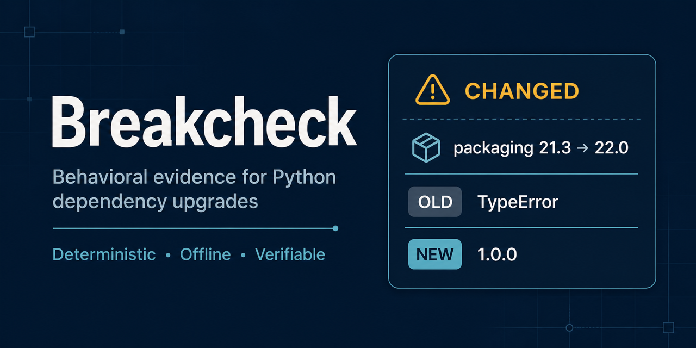

# Breakcheck

Dependabot tells you a new version exists. Breakcheck tells you whether the calls your code actually makes behave differently.

[](https://github.com/lovettsendit/breakcheck/actions/workflows/ci.yml)
[](https://pypi.org/project/breakcheck/)
[](https://pypi.org/project/breakcheck/)
[](LICENSE)

Breakcheck is a deterministic behavioral comparison tool for Python. It answers two bounded questions:

- Did a dependency upgrade change the behavior of supported calls already present in this repository?
- Did a code revision change the behavior of fixture-bound functions that were expected to remain stable?

Breakcheck compares observations. It does not guess intent, declare code correct, replace a test suite, or decide whether a change should ship. Calls it cannot lawfully exercise are reported as `NOT_EXERCISED`, never counted as safe.



## Install

```console
python -m pip install breakcheck
```

Breakcheck supports Python 3.10 through 3.13 on Linux and macOS and has no runtime package dependencies.

## See a real result in one command

```console
breakcheck demo --output-root .breakcheck/demo
```

The offline demo builds two small local package wheels, runs the installed CLI, detects a real behavioral difference, writes a report and evidence bundle, and verifies both. It does not contact a package index.

For the longer `packaging` 21.3 to 22.0 demonstration used by the release tests, run:

```console
sh examples/run_demo.sh
```

## Where Breakcheck fits

| Neighbor | Question it answers | Breakcheck's question |
| --- | --- | --- |
| Unit and integration tests | Does known expected behavior still pass? | Did these two observations differ? |
| Snapshot testing | Does output match an approved snapshot? | Did this specific dependency or revision change behavior? |
| Static analysis | Does this code match a rule or risk pattern? | Does supported code behave differently when replayed? |
| Traffic replay | What did recorded production requests do? | What can be compared without production traffic? |
| AI-generated tests | What should this code do, as inferred by a model? | What changed, without guessing intent? |

Breakcheck complements these tools. Its useful property is independence: a coding tool may propose a change or fixture, while deterministic replay and comparison decide the observed result.

## Dependency upgrades

Breakcheck holds your repository constant and varies one dependency:

```text
same repository calls x current wheel vs proposed wheel -> behavioral difference
```

### Quick start

Start at the root of the repository you want to analyze. Install the current dependency version in the interpreter running Breakcheck, then prepare an explicit local wheelhouse:

```console
python -m pip install 'attrs==23.2.0'
mkdir -p wheelhouse .breakcheck/results
python -m pip download --only-binary=:all: --dest wheelhouse 'attrs==23.2.0'
python -m pip download --only-binary=:all: --dest wheelhouse 'attrs==24.2.0'
```

Download exact versions in separate commands. Asking `pip download` to resolve two versions of the same distribution in one command can produce a dependency-resolution error.

Do not use `--no-deps`: the wheelhouse must contain the complete transitive dependency closure needed by both versions. If offline installation cannot resolve that closure, Breakcheck refuses with `ENVIRONMENT_INSTALL_REFUSED` and identifies the requirement without exposing pip output or local paths.

Run the comparison:

```console
breakcheck attrs@24.2.0 \
  --wheelhouse wheelhouse \
  --output .breakcheck/results/report.json \
  --evidence .breakcheck/results/evidence.json \
  --coverage-report .breakcheck/results/coverage.json \
  --json \
  --ci
```

Breakcheck creates fresh replay environments, installs only from the supplied wheelhouse, runs admitted calls twice in each environment, and compares normalized observations. Environments created under the default temporary runtime are removed when the command finishes, including after a failure. Supplying `--runtime-root` preserves that explicit runtime for operator-managed retention and cleanup.

Treat every wheel as executable input. Obtain wheels from a source you trust and preserve expected hashes in your own supply-chain records.

### Supported call surface

Breakcheck is strongest on pure, value-in/value-out library calls: parsing, serialization, validation, encoding, schema coercion, and deterministic numeric or string transformations.

The default static path supports:

- direct imports and statically attributable package calls;
- Python literal arguments;
- bounded constant expressions and f-strings;
- safe, single-assignment module constants;
- nested calls to the target package or a small fixed allowlist of pure standard-library modules;
- normalizable values, exceptions, mappings with string keys, sequences, sets, finite numbers, strings, and bytes.

It does not pretend to exercise network clients, arbitrary filesystem work, stateful object graphs, dynamic dispatch, unbounded computation, or rich return objects without an explicit projection. Those cases remain visible in the coverage report.

### Coverage diagnostics

Every discovered candidate reaches exactly one terminal bucket:

- `EXERCISED`
- `G1_NOT_DISCOVERABLE`
- `G2_NONLITERAL`
- `G3_UNNORMALIZABLE`
- `G4_IMPURE`

`--coverage-report` writes the machine-readable candidate inventory, reason codes, reason details, and argument provenance. A run that exercises nothing exits nonzero unless a human explicitly passes `--allow-empty`; that choice is recorded in the artifact.

### Generate fixture suggestions

For a fast static pass, run `--suggest-fixtures` without `--wheelhouse`. This scans for unresolved G2 arguments and generates reviewable skeletons without creating replay environments:

```console
breakcheck attrs@24.2.0 \
  --suggest-fixtures breakcheck.fixtures.toml
```

The generated file identifies each unresolved call by repository-relative file, line, column, API, and nearby source. A human or coding tool fills in concrete expressions and changes `fixture_authored_by` from `unknown` to `human` or `agent`.

To also find deterministic rich results that reach `G3_UNNORMALIZABLE`, supply the explicit wheelhouse used for comparison:

```console
breakcheck attrs@24.2.0 \
  --wheelhouse wheelhouse \
  --suggest-fixtures breakcheck.fixtures.toml
```

With `--wheelhouse`, Breakcheck performs isolated replay in both dependency environments. A repeatable rich result adds a skeleton marked `G3_UNNORMALIZABLE` with `projection = ""`. Breakcheck does not invent a projection: an agent or human must fill in a stable expression that references `outcome`, then present the fixture diff for human review. Impure or nondeterministic calls remain excluded from replay-backed suggestions.

Example:

```toml
schema_version = 1

[[binding]]
fixture_authored_by = "agent"
file = "src/app/serialize.py"
line = 42
column = 8
api = "attrs.asdict"
args = ["Point(1, 2)"]
kwargs = {}
setup = """
import attrs
@attrs.define
class Point:
    x: int
    y: int
"""
```

Review the fixture diff, then run:

```console
breakcheck attrs@24.2.0 \
  --wheelhouse wheelhouse \
  --fixtures breakcheck.fixtures.toml \
  --fixture-policy allow \
  --output .breakcheck/results/report.json \
  --evidence .breakcheck/results/evidence.json \
  --coverage-report .breakcheck/results/coverage.json \
  --ci
```

Fixture expressions and setup code execute inside the same best-effort isolation as dependency calls. They are trusted executable input, not data-only configuration.

### Project rich return values

A fixture may reduce a rich result to a stable, normalizable value:

```toml
[[binding]]
fixture_authored_by = "human"
file = "src/app/load.py"
line = 12
column = 8
api = "pandas.read_csv"
args = ["io.StringIO('a,b\\n1,2\\n')"]
kwargs = {}
setup = "import io"
projection = "(list(outcome.columns), outcome.shape, outcome.to_dict('list'))"
```

Projected results use explicit verdicts: `IDENTICAL_UNDER_PROJECTION` and `CHANGED_UNDER_PROJECTION`. They never imply that the complete rich object was identical.

## Code revisions

Breakcheck can also hold the environment constant and vary repository code:

```text
same fixture and environment x base revision vs head revision -> behavioral difference
```

This mode is for claims such as "this refactor preserves behavior." It cannot establish absolute correctness, judge intentional changes as bad, or verify new functions that have no baseline.

Revision commands create detached Git worktrees under an absent runtime path. They never check out over the user's working tree, touch the index, or stash changes. Worktrees are removed on success and on handled failure.

### Bind functions to inputs

Revision fixtures use the same file format, but point at function definitions:

```toml
schema_version = 1

[[binding]]
fixture_authored_by = "human"
file = "src/app/pricing.py"
line = 10
column = 0
api = "app.pricing.compute_total"
args = ["100", "0.15"]
kwargs = {}
```

For strict separation, commit fixtures against the base revision before making the code change. Breakcheck records fixture authorship, fixture hash, source revision, and whether the fixture predates the change.

### Capture a baseline

```console
breakcheck freeze \
  --revision HEAD \
  --fixtures breakcheck.fixtures.toml \
  --output .breakcheck/baseline.json
```

`freeze` records repeated normalized observations, source-tree identity, fixture identity, Python version, and platform. Dirty working trees are refused because silently omitting uncommitted changes would produce a misleading baseline.

### Compare two revisions

Compare explicit revisions:

```console
breakcheck diff \
  --base main \
  --head feature/refactor \
  --fixtures breakcheck.fixtures.toml \
  --strict-separation \
  --output .breakcheck/revision-report.json \
  --evidence .breakcheck/revision-evidence.json
```

Or compare against a verified baseline artifact:

```console
breakcheck diff \
  --baseline .breakcheck/baseline.json \
  --head HEAD \
  --fixtures breakcheck.fixtures.toml \
  --strict-separation \
  --output .breakcheck/revision-report.json \
  --evidence .breakcheck/revision-evidence.json
```

By default, Breakcheck selects top-level and class-level functions whose normalized signatures, bodies, or relevant non-callable module or class context changed. It also surfaces additions, removals, ambiguous definitions, and signature drift so structural changes cannot disappear from the comparison. Use a repeatable `--target module.path:symbol` to select targets explicitly. Missing baselines, import asymmetry, and unexercised targets remain distinct fail-closed results.

To disclose fixture retuning, pass an earlier verified revision report:

```console
breakcheck diff \
  --base main \
  --head HEAD \
  --fixtures breakcheck.fixtures.toml \
  --previous-report .breakcheck/previous-revision-report.json \
  --output .breakcheck/revision-report.json
```

When a changed fixture turns a prior `CHANGED` result into `IDENTICAL` for the same base and target, the new report emits `FIXTURE_REVISED_AFTER_FAILURE`. The event is visible and integrity-bound but does not automatically block the run because the original fixture may have been wrong. Breakcheck never infers this history from a mutable local cache; the prior report must be supplied explicitly.

### Adjudicate a preservation claim

A claim file lists exactly what the change asserts it preserved:

```toml
schema_version = 1
claim = "behavior_preserved"
base_revision = "0123456789abcdef0123456789abcdef01234567"

[[target]]
symbol = "app.pricing:compute_total"
```

Run:

```console
breakcheck attest \
  --head HEAD \
  --claim breakcheck.claim.toml \
  --fixtures breakcheck.fixtures.toml \
  --output .breakcheck/claim-report.json \
  --evidence .breakcheck/claim-evidence.json
```

The strict defaults require fixtures to predate the head revision and refuse to treat an unverifiable claim as success.

Claim dispositions are:

- `CLAIM_VERIFIED`: exercised and identical;
- `CLAIM_REFUTED`: exercised and changed;
- `CLAIM_UNVERIFIABLE`: not lawfully exercised;
- `CLAIM_OUT_OF_SCOPE`: the change touched symbols omitted from the claim.

## Using Breakcheck with AI-assisted development

Breakcheck provides a CLI and deterministic JSON contract; it does not require a model-specific server or protocol.

A productive division of labor is:

1. A coding agent proposes a dependency or code change.
2. Breakcheck identifies admitted and unresolved targets.
3. The agent may propose fixture values for unresolved targets.
4. A human reviews the fixture diff.
5. Breakcheck performs repeated replay, normalization, comparison, provenance recording, and refusal.
6. The agent reports `CHANGED`, `NOT_EXERCISED`, `CLAIM_REFUTED`, `CLAIM_UNVERIFIABLE`, and `CLAIM_OUT_OF_SCOPE` results verbatim for human review.

The agent must not edit reports, evidence, baselines, verdict logic, or a fixture after seeing an unfavorable result. It must not lower coverage or separation policy to obtain a passing run. Repository-local instructions are provided in [SKILL.md](SKILL.md).

Before sending any generated artifact to an external AI service, inspect and sanitize the report and evidence because they may contain repository code, arguments, outputs, and source locations.

This separation matters when software, tests, and review may all involve probabilistic tools: fixture proposals can be reviewed, while the replay and comparison outcome is deterministic and independently verifiable.

## Result semantics and exit codes

### Dependency and revision comparison

| Exit | Meaning |
| ---: | --- |
| `0` | The configured coverage requirement passed and no exercised behavior changed. |
| `2` | The request, input, or evidence was refused. |
| `3` | At least one exercised behavior changed. |
| `4` | Exercised coverage was below the configured minimum. |

Revision comparison always uses these semantic exit codes. Dependency comparison uses changed and coverage exit codes when `--ci` is present; without `--ci`, findings remain visible in the output but a changed result is informational. A dependency run that exercises nothing still exits nonzero unless `--allow-empty` was explicitly recorded.

### Claim attestation

| Exit | Meaning |
| ---: | --- |
| `0` | All claims admitted by the selected policy passed. Under the default strict policy, every claim was verified. |
| `1` | At least one claim was refuted. |
| `2` | At least one claim was unverifiable under strict policy. |
| `3` | Out-of-scope changed symbols were detected. |

An exit of `0` is evidence about admitted, exercised targets only. It is not a universal compatibility, correctness, or security claim.
Using `--no-strict` makes claim attestation advisory: unverifiable claims remain explicit in the report but do not by themselves make the command fail. Automated agents must not weaken the strict defaults.

## What Breakcheck does not prove

Breakcheck reports observed differences across the inputs it lawfully exercises. It does not prove that either side is correct, that unexercised paths are safe, that a dependency is secure, or that every platform behaves identically. A `CHANGED` result may describe an intentional improvement. Breakcheck does not decide whether an upgrade should ship; maintainers make that decision alongside ordinary unit, integration, security, and platform testing.

## Verify persisted evidence

```console
breakcheck \
  --verify .breakcheck/results/report.json \
  --evidence .breakcheck/results/evidence.json
```

Successful verification prints `VERIFIED`. Schema-2 verification checks the artifact envelope, payload hash, finding and witness identities, observation hashes, repeat hashes, replay-source hashes, projection hashes, provenance, ordering, counts, and report/evidence binding. Schema-1 reports from Breakcheck 1.x remain readable.

Hashes provide integrity and self-consistency, not identity or secrecy. They do not make your computer a server, open a network port, or reveal the original content from the digest alone.

## Machine-readable integration

Discover supported platforms, Python versions, schemas, and features without prompts:

```console
breakcheck --capabilities --json
```

All commands are noninteractive. Reports use a versioned schema, canonical JSON, stable identities, explicit provenance, and documented exit codes so CI and coding tools do not need to parse human prose.

The repository includes a compact workflow example at [examples/github-actions.yml](examples/github-actions.yml). Copy it into your project as `.github/workflows/breakcheck.yml`, then adapt the package versions and command to your dependency update process.

## Security and privacy

Breakcheck executes trusted package and repository code with a scrubbed environment, no shell, bounded resources, a fresh working directory, and a Python socket audit guard. These are containment measures, not a security boundary. Native extensions, subprocesses, import-time code, or code with the caller's operating-system permissions can still affect the host.

Reports and evidence may contain:

- repository-relative source locations and replay source;
- literal or fixture arguments and setup code;
- normalized return values and exception messages;
- captured output;
- source, fixture, environment, and observation hashes.

Inspect artifacts before sharing them with another person or an external service. Do not commit `.breakcheck/` output from a private repository. See [SECURITY.md](SECURITY.md) for the complete trust model.

## Release evidence

The repository includes bounded release measurements under `release_evidence/`:

- a 20-package dependency battery;
- a 16,002-call-site scale exercise;
- a three-repository fixture-loop viability run.

The fixture run records 49 generated bindings across three unrelated public repositories. In that bounded pre-release evaluation, one automated fixture-authoring pass produced 49 valid, executable, deterministic bindings and increased aggregate exercised calls from 1 to 50 without manual fixture edits. The included record preserves aggregate counts and fixture digests, but not enough source coordinates to serve as an independently reproducible benchmark. It is a release measurement, not a claim that the fixtures exhaust each repository's behavior.

## Development

```console
git clone https://github.com/lovettsendit/breakcheck.git
cd breakcheck
python -m venv .venv
source .venv/bin/activate
python -m pip install --upgrade pip
python -m pip install -e '.[test]'
python -m pytest -q
breakcheck --help
```

To build release artifacts:

```console
python -m pip install 'build>=1.2,<2'
python -m build
python -m pip install dist/breakcheck-2.0.1-py3-none-any.whl
breakcheck --capabilities --json
```

See [CONTRIBUTING.md](CONTRIBUTING.md) before proposing changes. Breakcheck is licensed under the [MIT License](LICENSE).
